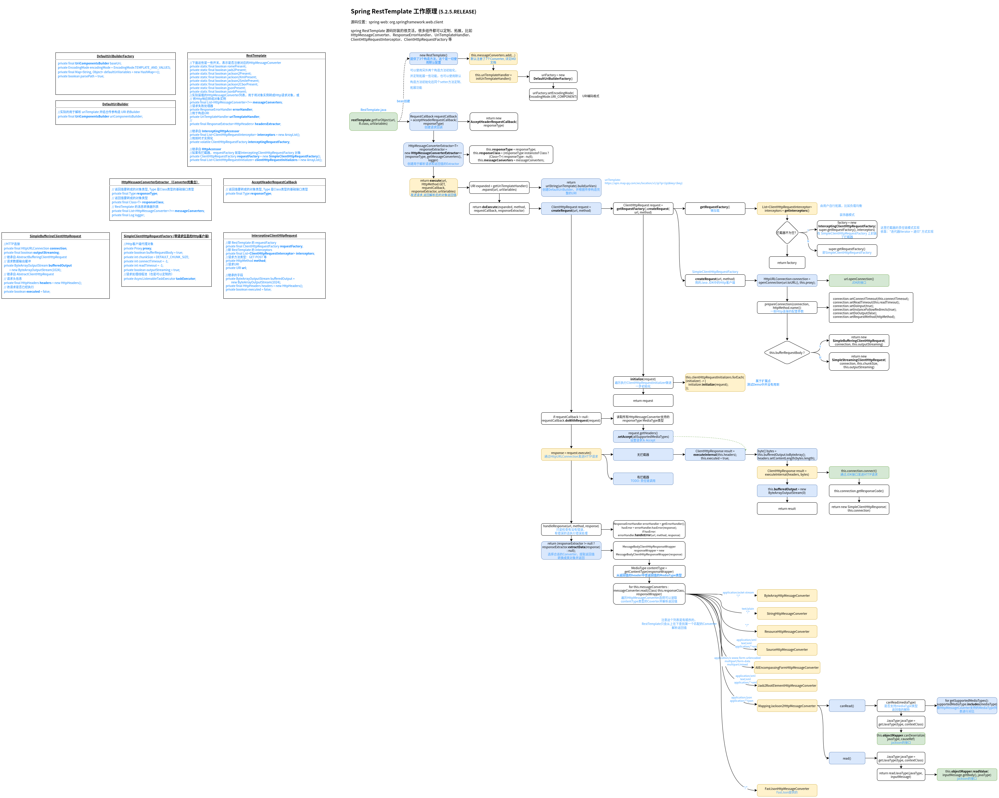

# Spring RestTemplate 封装原理

RestTemplate 是 Spring 框架提供的一个 HTTP 客户端工具类，用于发送 HTTP 请求并获取响应。在发送 HTTP 请求时，我们需要设置请求的 URL、请求方法、请求头、请求参数等信息，然后等待响应返回，解析响应内容。

RestTemplate 的封装原理主要基于 Java 的反射机制和动态代理技术。在 Spring 中，RestTemplate 通常是通过使用 RestTemplateBuilder 来创建的。RestTemplateBuilder 类提供了许多常用的配置方法，如设置超时时间、设置认证信息、设置拦截器等。最终，RestTemplateBuilder 会返回一个 RestTemplate 实例。

RestTemplate 实例中包含了许多用于发送 HTTP 请求的方法，如 getForObject()、getForEntity()、postForObject()、postForEntity() 等。这些方法通过调用底层的 HTTP 客户端来发送请求，并将响应转换成 Java 对象。

在底层，RestTemplate 使用了 Java 的 HttpURLConnection 类来发送 HTTP 请求，并使用 Jackson 库将 JSON 格式的响应转换成 Java 对象。RestTemplate 还支持其他的消息转换器，如 XML 消息转换器、字节消息转换器等。

RestTemplate 还提供了一些辅助方法，如 getForObject()、getForEntity()、postForObject()、postForEntity() 等，用于简化发送 HTTP 请求的过程。这些方法将请求的 URL、请求方法、请求头、请求参数等信息封装在一个对象中，并将该对象作为参数传递给 RestTemplate 实例的方法。RestTemplate 将使用反射和动态代理技术来解析该对象，并构造出一个完整的 HTTP 请求。

总的来说，RestTemplate 的封装原理是通过反射和动态代理技术将请求和响应对象封装起来，简化了 HTTP 客户端的使用，并提供了许多辅助方法来帮助我们发送 HTTP 请求。这些特性使得 RestTemplate 成为了开发者们在进行 Web 开发时非常实用的工具之一。

>  上面是ChatGPT的回答，看上去总结的还可以。但是并没有看到源码核心流程哪里有用到反射和动态代理，版本不一样?

## RestTemplate 工作原理

重点关注：

+ Bean初始化流程
  + RestTemplate Bean创建 & 组件及参数配置
+ 请求处理
  + 请求行、请求头、请求体的传参
  + 调用链路
  + 返回值的解析

源码流程图：

其实核心流程很简单如图



spring 源码封装的很灵活，很多组件都可以定制、拓展，比如

+ HttpMessageConverter

  用于解析返回值并转成需要的格式。

  默认注册了7个消息转换器，每次请求返回后，都会轮询一一匹配，使用最先找到的可以解析返回结果的HttpMessageConverter对返回值进行转换。

  ```
  this.messageConverters = {ArrayList@5035}  size = 7
   0 = {ByteArrayHttpMessageConverter@5056} 
   1 = {StringHttpMessageConverter@5057} 
   2 = {ResourceHttpMessageConverter@5058} 
   3 = {SourceHttpMessageConverter@5059} 
   4 = {AllEncompassingFormHttpMessageConverter@5060} 
   5 = {Jaxb2RootElementHttpMessageConverter@5061} 
   6 = {MappingJackson2HttpMessageConverter@5062} 
  ```

+ UriTemplateHandler

  用于根据uriTemplate以及请求行参数构造完整的URI，默认使用 DefaultUriBuilderFactory。

+ ResponseErrorHandler

  请求异常处理器。

+ ClientHttpRequestInterceptor

  请求过程中可以自定义拦截器逻辑，比如 @LoadBalanced 就是定义了一个拦截器，实现负载均衡请求。

+ ClientHttpRequestFactory

  用于创建HTTP请求（HTTP连接+请求参数）的工厂，默认是SimpleClientHttpRequestFactory。

