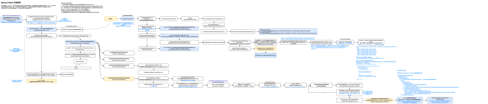

# Spring @Value 原理 & Bug 解析

SpringBoot项目中发现application.yml中的配置解析后注入到Bean失败。

代码如下：

```
rateLimiter:
  on: true

@Value("${rateLimiter.on}")
private Boolean on;
```
分析原因：SpringBoot使用snakeyaml解析yaml配置，snakeyaml默认会将yes、no、true、false、on、off转成Boolean类型的true、false。

解决方法：加引号转义。



