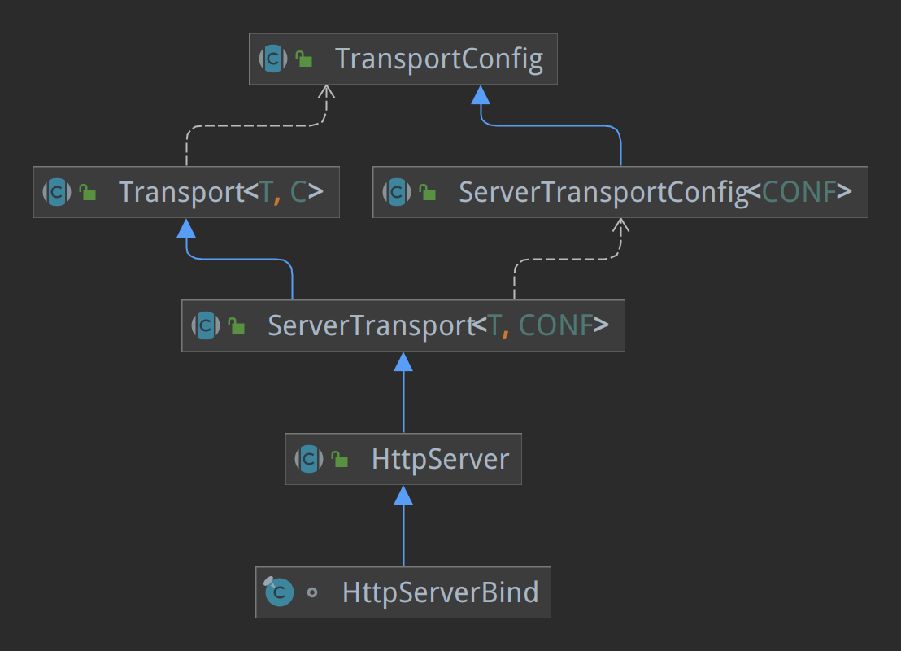
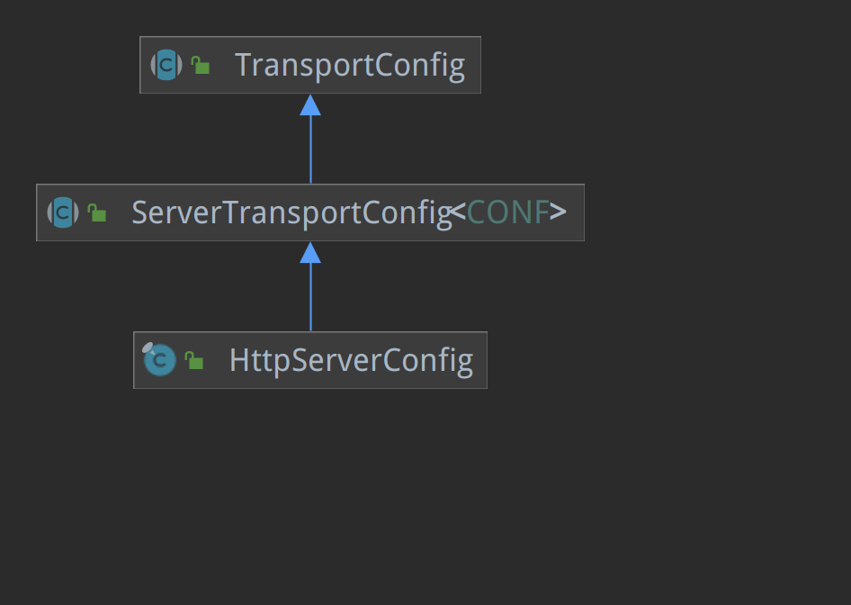

# [Spring WebFlux](https://docs.spring.io/spring-framework/docs/current/reference/html/web-reactive.html#webflux-new-framework)

关于响应式编程参考 develop-kit reactive-model。

WebFlux用于构建基于Reactive Streams API构建的、运行在非阻塞服务器(如Netty、Undertow和Servlet容器)上的响应式堆栈web应用程序。

资料比较少，只有官方的WebFlux文档能看，找了个简单的DEMO，直接看源码。主要分析WebFlux请求处理流程。

本来想先看下Reactor3源码实现，再看WebFlux源码实现的，但是发现Reactor3包含了大量的函数式编码，代码阅读和调试都不是很容易，先放一下。直接看WebFlux源码实现。


## 请求接收&分发调用堆栈

```java
getEmployeeById:24, EmployeeController (top.kwseeker.samples.flux.controller)
invoke0:-1, NativeMethodAccessorImpl (sun.reflect)
invoke:62, NativeMethodAccessorImpl (sun.reflect)
invoke:43, DelegatingMethodAccessorImpl (sun.reflect)
invoke:498, Method (java.lang.reflect)
lambda$invoke$0:144, InvocableHandlerMethod (org.springframework.web.reactive.result.method)
apply:-1, 2029959794 (org.springframework.web.reactive.result.method.InvocableHandlerMethod$$Lambda$621)
onNext:125, MonoFlatMap$FlatMapMain (reactor.core.publisher)
complete:1816, Operators$MonoSubscriber (reactor.core.publisher)
signal:251, MonoZip$ZipCoordinator (reactor.core.publisher)
onNext:336, MonoZip$ZipInner (reactor.core.publisher)
onNext:180, MonoPeekTerminal$MonoTerminalPeekSubscriber (reactor.core.publisher)
onNext:101, FluxDefaultIfEmpty$DefaultIfEmptySubscriber (reactor.core.publisher)
onNext:74, FluxSwitchIfEmpty$SwitchIfEmptySubscriber (reactor.core.publisher)
request:2398, Operators$ScalarSubscription (reactor.core.publisher)
set:2194, Operators$MultiSubscriptionSubscriber (reactor.core.publisher)
onSubscribe:2068, Operators$MultiSubscriptionSubscriber (reactor.core.publisher)
trySubscribeScalarMap:192, FluxFlatMap (reactor.core.publisher)
subscribeOrReturn:53, MonoFlatMap (reactor.core.publisher)
subscribe:4385, Mono (reactor.core.publisher)
subscribe:128, MonoZip (reactor.core.publisher)
subscribe:64, InternalMonoOperator (reactor.core.publisher)
subscribe:52, MonoDefer (reactor.core.publisher)
subscribeNext:236, MonoIgnoreThen$ThenIgnoreMain (reactor.core.publisher)
onComplete:203, MonoIgnoreThen$ThenIgnoreMain (reactor.core.publisher)
onComplete:181, MonoFlatMap$FlatMapMain (reactor.core.publisher)
complete:137, Operators (reactor.core.publisher)
subscribe:120, MonoZip (reactor.core.publisher)
subscribe:4400, Mono (reactor.core.publisher)
subscribeNext:255, MonoIgnoreThen$ThenIgnoreMain (reactor.core.publisher)
subscribe:51, MonoIgnoreThen (reactor.core.publisher)
subscribe:64, InternalMonoOperator (reactor.core.publisher)
onNext:157, MonoFlatMap$FlatMapMain (reactor.core.publisher)
onNext:74, FluxSwitchIfEmpty$SwitchIfEmptySubscriber (reactor.core.publisher)
onNext:82, MonoNext$NextSubscriber (reactor.core.publisher)
innerNext:282, FluxConcatMap$ConcatMapImmediate (reactor.core.publisher)
onNext:861, FluxConcatMap$ConcatMapInner (reactor.core.publisher)
onNext:127, FluxMapFuseable$MapFuseableSubscriber (reactor.core.publisher)
onNext:180, MonoPeekTerminal$MonoTerminalPeekSubscriber (reactor.core.publisher)
request:2398, Operators$ScalarSubscription (reactor.core.publisher)
request:139, MonoPeekTerminal$MonoTerminalPeekSubscriber (reactor.core.publisher)
request:169, FluxMapFuseable$MapFuseableSubscriber (reactor.core.publisher)
set:2194, Operators$MultiSubscriptionSubscriber (reactor.core.publisher)
onSubscribe:2068, Operators$MultiSubscriptionSubscriber (reactor.core.publisher)
onSubscribe:96, FluxMapFuseable$MapFuseableSubscriber (reactor.core.publisher)
onSubscribe:152, MonoPeekTerminal$MonoTerminalPeekSubscriber (reactor.core.publisher)
subscribe:55, MonoJust (reactor.core.publisher)
subscribe:4400, Mono (reactor.core.publisher)
drain:449, FluxConcatMap$ConcatMapImmediate (reactor.core.publisher)
onSubscribe:219, FluxConcatMap$ConcatMapImmediate (reactor.core.publisher)
subscribe:165, FluxIterable (reactor.core.publisher)
subscribe:87, FluxIterable (reactor.core.publisher)
subscribe:64, InternalMonoOperator (reactor.core.publisher)
subscribe:52, MonoDefer (reactor.core.publisher)
subscribe:4400, Mono (reactor.core.publisher)
subscribeNext:255, MonoIgnoreThen$ThenIgnoreMain (reactor.core.publisher)
subscribe:51, MonoIgnoreThen (reactor.core.publisher)
subscribe:64, InternalMonoOperator (reactor.core.publisher)
onStateChange:962, HttpServer$HttpServerHandle (reactor.netty.http.server)
onStateChange:671, ReactorNetty$CompositeConnectionObserver (reactor.netty)
onStateChange:478, ServerTransport$ChildObserver (reactor.netty.transport)
onInboundNext:560, HttpServerOperations (reactor.netty.http.server)
channelRead:93, ChannelOperationsHandler (reactor.netty.channel)
invokeChannelRead:379, AbstractChannelHandlerContext (io.netty.channel)
invokeChannelRead:365, AbstractChannelHandlerContext (io.netty.channel)
fireChannelRead:357, AbstractChannelHandlerContext (io.netty.channel)
channelRead:220, HttpTrafficHandler (reactor.netty.http.server)
// HttpTrafficHandler 

invokeChannelRead:379, AbstractChannelHandlerContext (io.netty.channel)
invokeChannelRead:365, AbstractChannelHandlerContext (io.netty.channel)
fireChannelRead:357, AbstractChannelHandlerContext (io.netty.channel)
fireChannelRead:436, CombinedChannelDuplexHandler$DelegatingChannelHandlerContext (io.netty.channel)
fireChannelRead:324, ByteToMessageDecoder (io.netty.handler.codec)
channelRead:296, ByteToMessageDecoder (io.netty.handler.codec)
channelRead:251, CombinedChannelDuplexHandler (io.netty.channel)
invokeChannelRead:379, AbstractChannelHandlerContext (io.netty.channel)
invokeChannelRead:365, AbstractChannelHandlerContext (io.netty.channel)
fireChannelRead:357, AbstractChannelHandlerContext (io.netty.channel)
channelRead:1410, DefaultChannelPipeline$HeadContext (io.netty.channel)
invokeChannelRead:379, AbstractChannelHandlerContext (io.netty.channel)
invokeChannelRead:365, AbstractChannelHandlerContext (io.netty.channel)
fireChannelRead:919, DefaultChannelPipeline (io.netty.channel)
epollInReady:795, AbstractEpollStreamChannel$EpollStreamUnsafe (io.netty.channel.epoll)
processReady:480, EpollEventLoop (io.netty.channel.epoll)
run:378, EpollEventLoop (io.netty.channel.epoll)
run:986, SingleThreadEventExecutor$4 (io.netty.util.concurrent)
run:74, ThreadExecutorMap$2 (io.netty.util.internal)
run:30, FastThreadLocalRunnable (io.netty.util.concurrent)
run:750, Thread (java.lang)
```

从这个调用堆栈可以看到，WebFlux 默认使用的Netty作为Web服务器。

### 启动流程

onRefresh() 阶段创建Web服务器，WebServerManager 包含三个重要组件

```java
private final ReactiveWebServerApplicationContext applicationContext;
private final DelayedInitializationHttpHandler handler;	// HttpHandler类型Bean
private final WebServer webServer;

this.serverManager = new WebServerManager(this, webServerFactory, this::getHttpHandler, lazyInit);

protected HttpHandler getHttpHandler() {
    String[] beanNames = this.getBeanFactory().getBeanNamesForType(HttpHandler.class);
    if (beanNames.length == 0) {
        throw new ApplicationContextException("Unable to start ReactiveWebApplicationContext due to missing HttpHandler bean.");
    } else if (beanNames.length > 1) {
        throw new ApplicationContextException("Unable to start ReactiveWebApplicationContext due to multiple HttpHandler beans : " + StringUtils.arrayToCommaDelimitedString(beanNames));
    } else {
        return (HttpHandler)this.getBeanFactory().getBean(beanNames[0], HttpHandler.class);
    }
}

//NettyReactiveWebServerFactory
public WebServer getWebServer(HttpHandler httpHandler) {
    HttpServer httpServer = this.createHttpServer();
    ReactorHttpHandlerAdapter handlerAdapter = new ReactorHttpHandlerAdapter(httpHandler);
    NettyWebServer webServer = this.createNettyWebServer(httpServer, handlerAdapter, this.lifecycleTimeout, this.getShutdown());
    webServer.setRouteProviders(this.routeProviders);
    return webServer;
}
```

NettyWebServer

```java
private final HttpServer httpServer;
private final BiFunction<? super HttpServerRequest, ? super HttpServerResponse,
    ? extends Publisher<Void>> handler;
private final Duration lifecycleTimeout;
private final GracefulShutdown gracefulShutdown;
private List<NettyRouteProvider> routeProviders = Collections.emptyList();
private volatile DisposableServer disposableServer;
```

HttpServer 具象类型 HttpServerBind





### HttpTrafficHandler

使用Netty处理Web请求，一定需要定义一个ChannelHandler，根据堆栈上下文看到了 HttpTrafficHandler。

调试可以看到Pipeline中的Handler组件:

+ DefaultChannelPipeline$**HeadContext**

+ io.netty.handler.codec.http.**HttpServerCodec**

  用的Netty实现的Http编解码器。

+ reactor.netty.http.server.**HttpTrafficHandler**

+ reactor.netty.channel.**ChannelOperationsHandler**

+ DefaultChannelPipeline$**TailContext**


